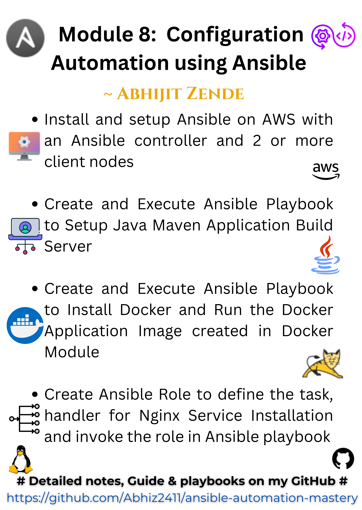

# 🚀 Ansible Automation Mastery

Welcome to **Ansible Automation Mastery**! 🛠️✨

This repository contains step-by-step guides, notes, and examples for mastering Ansible in DevOps. Dive in and automate your configurations like a pro! 💻⚡

---

## 📚 Module 8: Configuration Automation using Ansible

### 🌟 Tasks Included:

1️⃣ **Install and Setup Ansible**
   - Configure Ansible Controller and Clients on AWS 🖥️

2️⃣ **Create and Execute Ansible Playbook**
   - Automate the setup of a Java Maven Build Server 📦✨

3️⃣ **Playbook for Docker Setup**
   - Install Docker and Run a Dockerized Application 🐳🔧

4️⃣ **Create and Invoke Ansible Role**
   - Automate Nginx Service Installation 📜➕

---

## 📒 What's Inside:

- **Ansible Notes for Beginners** 📖
  - Easy-to-understand guides and tips 📝

- **Commonly Used Playbooks** 📜
  - Real-world examples you can copy and modify 🔄

- **Tasks with Detailed Steps** 🛠️
  - Explained with screenshots and YAML examples 🖼️

---

## 🎯 Key Features:

- **Comprehensive Setup Instructions** 🔍
- **Best Practices for Ansible Playbooks** ✅
- **Reusable Roles for Automation** 🔄

---

## 🌐 Additional Resources

🔗 **[My Portfolio](https://abhijit-zende.vercel.app/)**  
🔗 **[Hashnode Blog](https://abhijitzende.hashnode.dev/)**

---

## 💡 How to Use:

1️⃣ Clone the Repository: `git clone https://github.com/<username>/ansible-automation-mastery.git`  
2️⃣ Explore the Notes and Examples 📂  
3️⃣ Execute the Playbooks 🚀

---

## 📢 Feedback & Contributions:

🤝 Found something cool? Raise a PR!  
💬 Have suggestions? Open an Issue!  

---

## 📜 License:

This repository is licensed under the MIT License. Feel free to use and share! 💌

